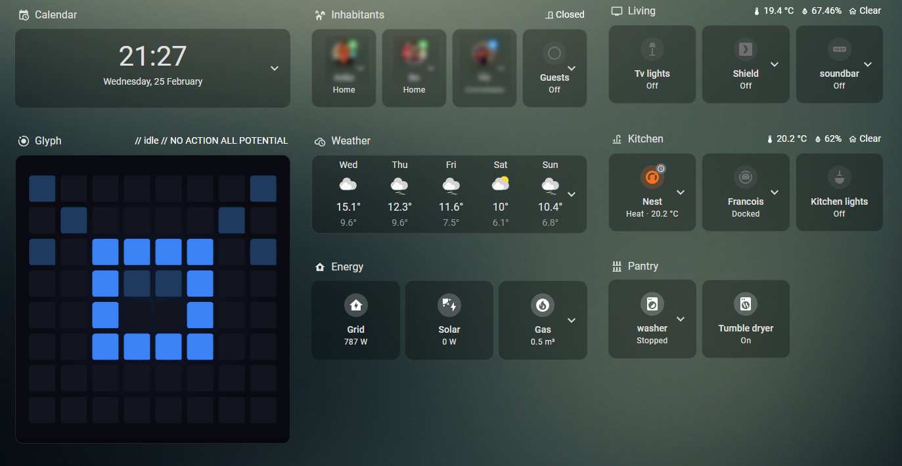
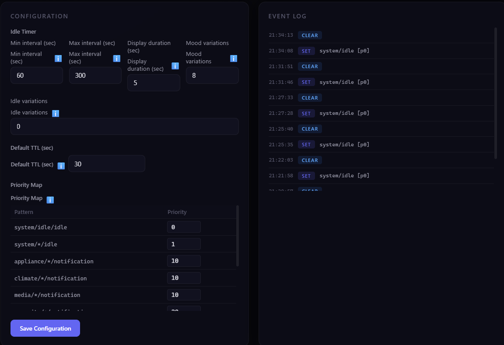
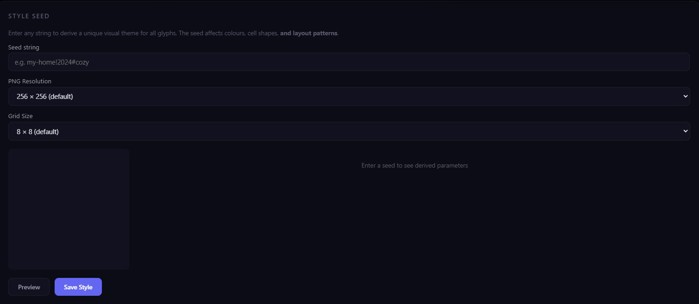
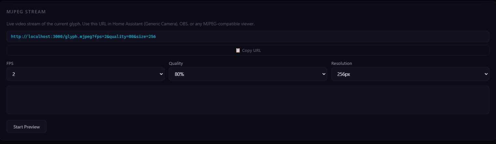
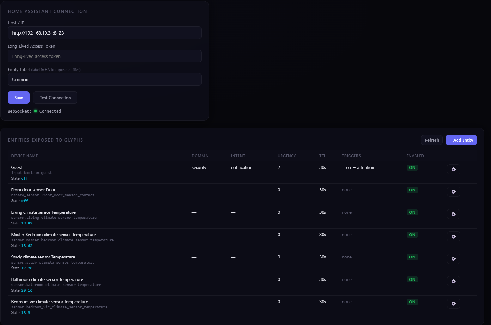
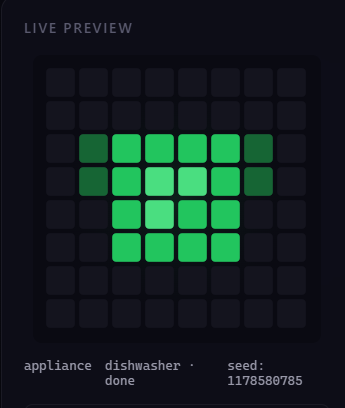
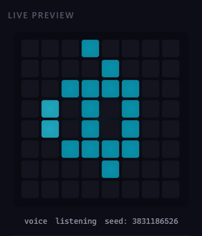
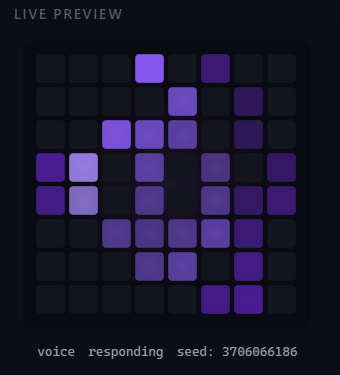

# Ummon Glyph UI

A visual glyph system for Home Assistant that procedurally generates grid-based block patterns that form a consistent symbolic language for your smart home.

> Not art, not emojis ... just machine sigils representing meaning.

  

---


## Disclaimer

```
This project was built with the help of an LLM. Yes, a machine helped build the machine sigils. Make of that what you will.

I won't be actively monitoring issues or pull requests. (sorry) It's a thing that exists because I read the Hyperion Cantos a long time ago, and, for reasons unclear, UMMON drifted back into my thoughts while I was tinkering with Home Assistant.

If it breaks, it breaks. If it works, enjoy watching your dishwasher speak in glyphs. KWATZ!
```


## That being out of the way ... What Is This?

So, Ummon turns Home Assistant events into unique visual glyphs. Each glyph is a grid-based pattern generated from metadata (domain, device, status, intent, urgency) - the **same event always produces the same glyph**. Over time you start to *"recognize"* what's happening at a glance, without reading a single word.


*The main display showing a glyph. This is what you'd put on a wall-mounted tablet or dashboard.*



*Alternatively you can add the camera stream to Home Assistant.*


### What Can It Do?

- **Deterministic glyphs**: seeded PRNG, same input = same output, every time
- **6 domain patterns**: appliance, system, security, climate, media, voice (can be expanded by modifying the some json files)
- **Color-coded statuses**: green/blue/yellow/red/purple/cyan/violet
- **Urgency accents**: corner cells light up (0–5 levels), high urgency blinks
- **Seed-based theming**: one seed string transforms colors, glow, layout, symmetry
- **Idle variations**: the resting glyph subtly shifts each cycle so it feels alive
- **Home Assistant integration**: label-based entity monitoring with trigger rules
- **Real-time everything**: SSE stream, PNG endpoint, MJPEG video stream
- **Admin dashboard**: send glyphs, tweak priorities, manage themes
- **Optional auth**: cookie-based admin login + API key for ingestion
- **Docker & Unraid ready**: docker-compose and unraid template included


## Screenshots

### Admin panel


*Sending and testing glyphs*



*Configuring timers, variations, and priorities*



*Configuring seed, resolution, and grid size*



*Configure the MJPEG stream*

### Home assistant panel


*Connect with Home Assistant and make rules to display glyphs on certain events.*


---

## Quick Start

### Node.js

```bash
npm install
npm start
```

| Page | URL |
|------|-----|
| Display | http://localhost:3000 |
| Admin | http://localhost:3000/admin |
| HA Integration | http://localhost:3000/ha-admin |
| PNG | http://localhost:3000/glyph.png |
| MJPEG | http://localhost:3000/glyph.mjpeg |

### Docker Compose

```bash
docker compose up -d
```

### Docker CLI

```bash
docker build -t ummon-glyph-ui .

docker run -d \
  --name ummon-glyph-ui \
  -p 3000:3000 \
  -v ./config:/app/config \
  -e PUID=1000 \
  -e PGID=1000 \
  -e UMASK=022 \
  -e UMMON_USERNAME=admin \
  -e UMMON_PASSWORD=secret \
  ummon-glyph-ui
```

### Unraid

Install via Community Applications* or use the included `unraid-template.xml`.

| Setting | Default |
|---------|---------|
| PUID | 99 (nobody) |
| PGID | 100 (users) |
| Config path | `/mnt/user/appdata/ummon-glyph-ui/config` |

*needs work

---

## Environment Variables

| Variable | Default | Description |
|----------|---------|-------------|
| `PUID` | `1000` | User ID for file ownership |
| `PGID` | `1000` | Group ID for file ownership |
| `UMASK` | `022` | File creation mask |
| `PORT` | `3000` | Server port |
| `UMMON_USERNAME` | — | Admin username (leave empty to disable auth) |
| `UMMON_PASSWORD` | — | Admin password |
| `UMMON_API_KEY` | — | API key for `POST /glyph` and `POST /clear` |
| `UMMON_CONFIG_DIR` | `/app/config` | Where config files live |
| `UMMON_STYLE_SEED` | — | Initial style seed |

---

## Sending Glyphs

### Basic

```bash
curl -X POST http://localhost:3000/glyph \
  -H "Content-Type: application/json" \
  -d '{"domain":"appliance","device":"dishwasher","status":"done","intent":"notification"}'
```

### With API Key

```bash
curl -X POST http://localhost:3000/glyph \
  -H "Content-Type: application/json" \
  -H "X-API-Key: your-secret-key" \
  -d @demo/appliance-dishwasher-done.json
```

### Demo Payloads

There's a bunch of example payloads in `demo/` — fire them all at once to see what different glyphs look like:

```bash
./demo/send.sh --all          # Bash
.\demo\send.ps1 -All          # PowerShell
```

### Glyph Metadata

This is what a glyph payload looks like:

```json
{
  "domain": "appliance",
  "device": "dishwasher",
  "status": "done",
  "intent": "notification",
  "urgency": 0,
  "ttl": 30
}
```

| Field | Required | Values |
|-------|----------|--------|
| `domain` | Yes | `appliance`, `system`, `security`, `climate`, `media`, `voice` |
| `status` | Yes | `done`, `idle`, `listening`, `responding`, `running`, `warning`, `error`, etc. |
| `intent` | Yes | `notification`, `idle`, `voice`, `automation`, `alert`, `status` |
| `device` | Depends | Required for `appliance`, `security`, `climate`, `media` |
| `urgency` | No | 0–5 (corner accents + blink at higher levels) |
| `ttl` | No | Seconds before the glyph expires and returns to idle (default: 30) |


*A few different glyphs: each domain has a distinct base pattern, each status has its own color.*

  


---

## Home Assistant Integration

You can hook Ummon directly into Home Assistant, label some entities and it'll automatically fire glyphs when things change.


*The HA integration panel — connect to your instance, pick entities, set up trigger rules.*

### Setup

1. In Home Assistant, create a label (e.g. `glyph`) and assign it to entities you want to monitor
2. Go to **HA Integration** (`/ha-admin`) in Ummon
3. Enter your HA host and a **long-lived access token**
4. Save & test the connection
5. Labeled entities show up automatically

### Entity Configuration

For each entity you can set:
- **Domain**: auto-detected from HA, but you can override it
- **Device name**: friendly name for the glyph
- **Intent**: notification, alert, status, etc.
- **Urgency**: default urgency level
- **TTL**: how long the glyph stays up
- **Triggers**: rules that fire glyphs on state changes

### Trigger Rules

Each trigger defines when a glyph fires:

| Operator | Types | Example |
|----------|-------|---------|
| `=`, `!=` | String/Number | state = "on" |
| `<`, `>`, `<=`, `>=` | Number | temperature > 25 |

Triggers can override the status and urgency of the fired glyph.

### WebSocket Monitoring

Once connected, Ummon listens to HA `state_changed` events over WebSocket in real-time. When a trigger matches, the glyph fires automatically, no Node-RED needed for basic stuff.

---

## API Reference

| Method | Endpoint | Auth | What It Does |
|--------|----------|------|--------------|
| `POST` | `/glyph` | API Key | Set the active glyph |
| `POST` | `/clear` | API Key | Clear display, go back to idle |
| `GET` | `/glyph.png` | Public | Current glyph as PNG |
| `GET` | `/glyph.mjpeg` | Public | MJPEG video stream (for HA cameras) |
| `GET` | `/events` | Public | SSE event stream |
| `GET` | `/api/state` | Public | Current state as JSON |
| `GET` | `/api/message` | Public | Current display message |
| `GET` | `/api/config` | Admin | Get server config |
| `POST` | `/api/config` | Admin | Update config |
| `GET` | `/api/history` | Admin | Last 50 events |
| `GET` | `/api/definitions` | Admin | Domains, intents, quick actions |
| `GET` | `/api/style` | Admin | Style seed & resolution |
| `POST` | `/api/style` | Admin | Update style |
| `GET` | `/api/ha/config` | Admin | HA integration config |
| `POST` | `/api/ha/config` | Admin | Save HA connection |
| `POST` | `/api/ha/test` | — | Test HA connection |
| `GET` | `/api/ha/entities` | Admin | Labeled entities |
| `GET` | `/api/ha/all-entities` | Admin | All HA entities |
| `POST` | `/api/ha/entity` | Admin | Save entity override |
| `DELETE` | `/api/ha/entity/:id` | Admin | Delete entity override |
| `GET` | `/api/ha/status` | Admin | WebSocket connection status |
| `POST` | `/api/ha/label` | Admin | Update label name |

---

## Config Files

Everything persists in the `config/` volume — defaults are auto-copied on first run:

| File | What's In It |
|------|--------------|
| `domains.json` | Domain definitions |
| `intents.json` | Intent definitions |
| `quick-actions.json` | Admin quick-action presets |
| `style.json` | Style seed, PNG resolution, grid size |
| `moods.json` | Idle mood names |
| `auth.json` | Credentials (auto-generated) |
| `ha-config.json` | HA connection settings (auto-generated) |
| `ha-entities.json` | Entity overrides (auto-generated) |

---

## Project Structure

```
├── Dockerfile
├── entrypoint.sh
├── docker-compose.yml
├── unraid-template.xml
├── package.json
├── config/                    # Default config files
├── src/
│   ├── server.js              # Express server + API routes
│   ├── config.js              # Priority map, defaults
│   ├── auth.js                # Admin + API key auth
│   ├── state-manager.js       # Glyph state, TTL, SSE, MJPEG
│   ├── png-renderer.js        # Server-side PNG/JPEG via Sharp
│   └── ha-integration.js      # Home Assistant WebSocket
├── public/
│   ├── index.html             # Display (full-viewport glyph)
│   ├── admin.html             # Admin dashboard
│   ├── ha-admin.html          # HA integration panel
│   ├── login.html             # Login page
│   ├── css/style.css          # Dark theme
│   └── js/
│       ├── glyph-engine.js    # Deterministic generation (UMD)
│       ├── glyph-renderer.js  # Canvas renderer
│       ├── app.js             # Display logic
│       ├── admin.js           # Admin logic
│       ├── ha-panel.js        # HA panel logic
│       └── ha-panel-connection.js
└── demo/                      # 15+ example payloads + scripts
```

---

## How It Works

1. **Something happens**: HA fires an event (dishwasher done, door opened, etc.)
2. **Metadata gets built**: Node-RED or the HA integration creates glyph metadata
3. **Glyph gets sent**: `POST /glyph` or automatic trigger from the HA WebSocket
4. **Pattern gets generated**: deterministic seed → grid pattern with domain-specific layout + urgency corners + style transforms
5. **It gets rendered**: PNG on the server (Sharp), MJPEG stream, animated canvas on the client
6. **Everyone sees it**: all connected SSE clients update instantly
7. **It expires**: after TTL seconds, display returns to idle (with optional variations)


---

## Tech Stack

| Component | Technology |
|-----------|------------|
| Server | Node.js 20 + Express |
| PNG rendering | Sharp |
| Client rendering | HTML5 Canvas |
| Real-time | SSE + WebSocket (HA) |
| Auth | bcryptjs |
| HTTP | axios |
| Container | Docker (Alpine, multi-stage, su-exec) |

---

## License

MIT

---


